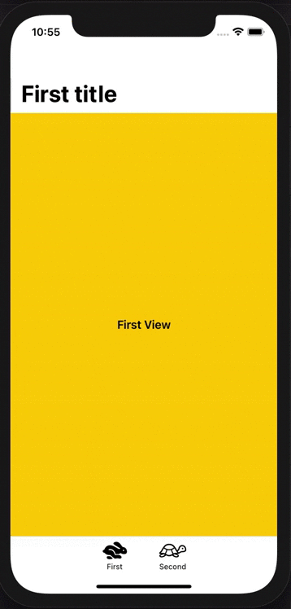

[](https://swift.org/download/)
[](https://twitter.com/hikeland)

# Custom TabBar in SwiftUI



# Issues that led me to create my own TabBar

TabView in SwiftUI has two important problems to me:
* It does not allow notification badges
* We cannot hide the tabBar when opening a NavigationLink inside a tab

# What this sample app does

This sample code shows how we can create easily our own custom TabBar with ZStack.

**Your TabView can be customized in the tabBarView property. Do whatever you want here.**

  ``` swift
    var tabBarView: some View {
        VStack(spacing: 0) {
            Divider()
            
            HStack(spacing: 20) {
                tabBarItem(.first, title: "First", icon: "hare", selectedIcon: "hare.fill")
                tabBarItem(.second, title: "Second", icon: "tortoise", selectedIcon: "tortoise.fill")
            }
            .padding(.top, 8)
        }
        .frame(height: 50)
        .background(Color.white.edgesIgnoringSafeArea(.all))
    }
  ```

**Views are stored as properties in the ContentView to keep the current navigation state when changing tabs:**

  ``` swift
    private var firstView = FirstView()
    private var secondView = SecondView()
  ```

**If you don't need to hide the TabBar on any view, use it like this:**

  ``` swift
    var body: some View {
        VStack(spacing: 0) {
            ZStack {
                if selectedTab == .first {
                    firstView
                }
                else if selectedTab == .second {
                    secondView
                }
            }
            .animation(nil)

            tabBarView
        }
    }
  ```

**If you need to hide the TabBar in the second view, use it like this:**

  ``` swift
    var body: some View {
        VStack(spacing: 0) {
            ZStack {
                if selectedTab == .first {
                    firstView
                }
                else if selectedTab == .second {
                    NavigationView {
                        VStack(spacing: 0) {
                            secondView
                            tabBarView
                        }
                    }
                }
            }
            .animation(nil)
            
            if selectedTab != .second {
                tabBarView
            }
        }
    }
  ```

Feel free to ask me your questions on [Twitter](https://twitter.com/hikeland).